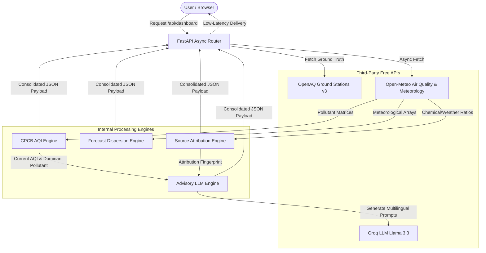

# VayuDrishti — See the Air Before You Breathe It

[](https://opensource.org/licenses/MIT)
[]()
[]()
[]()

**ET AI Hackathon 2026 · Problem Statement 5**  
*AI-Powered Urban Air Quality Intelligence for Smart City Interventions.*

---

## 📖 Overview

**VayuDrishti** is a zero-cost, high-resolution environmental intelligence platform designed to monitor, forecast, and attribute air pollution across Indian municipalities. By shifting from retrospective tracking to **predictive intelligence**, the platform enables municipal administrators to dispatch preemptive advisories and deploy targeted traffic and industrial control vectors.

### 🌟 Key Features
* **CPCB NAQI Compliant**: Computes official Indian Central Pollution Control Board (CPCB) NAQI metrics rather than the standard US EPA formula.
* **72-Hour Hyperlocal Forecasting**: Combines high-resolution meteorology and chemical dispersion models to predict AQI indices and warn of category threshold crossings.
* **Explainable Source Attribution**: Dissects hourly pollutant levels using meteorology, temporal signatures (traffic patterns), and chemical markers (e.g. $NO_2/PM_{2.5}$) via a transparent heuristic matrix.
* **Multilingual AI Health Advisories**: Integrates LLMs (Groq Llama 3.3) to generate dynamic recommendations custom-tailored to local air profiles, supporting **English, Hindi, Bengali, Tamil, Telugu, and Kannada**.
* **Dual Portal Interface**: Features a **Citizen Portal** for quick safety assessments and a **Municipal Command Center** dark theme for administrative controls.

---

## 🛠️ System Architecture & Data Flow

VayuDrishti uses a modern, decoupled client-server architecture. To ensure production scalability, all integrations are designed for zero-cost API endpoints.



---

## 📂 Project Directory Structure

```
VayuDrishti/
├── docs/
│   └── architecture.md             # Detailed architecture and data model documentation
├── backend/
│   ├── app/
│   │   ├── api/                    # FastAPI HTTP Endpoints
│   │   │   ├── advisory.py         # LLM text advisory generation routes
│   │   │   ├── aqi.py              # Current CPCB index calculations
│   │   │   ├── locations.py        # Location geocoding router
│   │   │   ├── forecast.py         # 72-hour forecasting route
│   │   │   ├── map_data.py         # GeoJSON mapping coordinates
│   │   │   └── health.py           # Connectivity verification checks
│   │   ├── core/
│   │   │   └── config.py           # Dotenv schemas & server configuration
│   │   ├── data/
│   │   │   └── cpcb_breakpoints.py # Official CPCB NAQI pollutant index maps
│   │   ├── engines/
│   │   │   ├── aqi_engine.py       # CPCB NAQI linear interpolator
│   │   │   ├── forecast_engine.py  # 72h trend and threshold crossing compiler
│   │   │   ├── attribution_engine.py# Heuristic source fingerprinting solver
│   │   │   └── advisory_engine.py  # Groq client prompting helper
│   │   ├── services/
│   │   │   ├── geocoding_client.py # Open-Meteo coordinate resolver
│   │   │   ├── openaq_client.py    # Ground truth station retrieval
│   │   │   ├── openmeteo_client.py # Meteorological and AQ dispersion forecasts
│   │   │   └── groq_client.py      # LLM client with structured fallbacks
│   │   └── main.py                 # FastAPI App Initialization & CORS settings
│   ├── tests/
│   │   └── test_aqi_engine.py      # Unit tests for CPCB AQI conversions
│   ├── requirements.txt            # Python dependencies
│   └── .env.example                # Template for environment keys
└── frontend/
    ├── src/
    │   ├── components/
    │   │   ├── SearchBar.jsx       # Geocoding-enabled lookup input
    │   │   ├── AqiBadge.jsx        # Citizen AQI radial dial and details card
    │   │   ├── ForecastChart.jsx   # Custom SVG CPCB trajectory timeline
    │   │   ├── AttributionPanel.jsx# Distribution grid representing source shares
    │   │   ├── MapView.jsx         # Leaflet.js interactive maps
    │   │   ├── PollutantGrid.jsx   # Detailed sub-pollutant matrix display
    │   │   └── WeatherBar.jsx      # Meteorological covariate tracker
    │   ├── services/
    │   │   └── api.js              # Fetch handlers mapping to FastAPI backend
    │   ├── utils/
    │   │   └── cpcbColors.js       # Color schemas matching CPCB categories
    │   ├── App.jsx                 # View routing and state organizer
    │   ├── main.jsx                # DOM mounting entry point
    │   └── index.css               # Styling guidelines and Tailwind rules
    ├── tailwind.config.js          # Responsive grid sizing and styling variables
    ├── vite.config.js              # Production packager configurations
    └── package.json                # Frontend package dependencies
```

---

## 🧮 Core Calculations & Heuristic Models

### 1. CPCB National AQI (NAQI) Equation
Air Quality Index (AQI) values are calculated for each pollutant using the official linear interpolation formula defined by the Indian CPCB:

$$I_p = \frac{I_{high} - I_{low}}{BP_{high} - BP_{low}} \times (C_p - BP_{low}) + I_{low}$$

Where:
* $I_p$: Sub-index of pollutant $p$.
* $C_p$: Concentration of pollutant $p$.
* $BP_{high}$: Breakpoint concentration greater than or equal to $C_p$.
* $BP_{low}$: Breakpoint concentration less than or equal to $C_p$.
* $I_{high}$: AQI sub-index value corresponding to $BP_{high}$.
* $I_{low}$: AQI sub-index value corresponding to $BP_{low}$.

The overall AQI is the **maximum sub-index** among the active pollutants, and that pollutant is designated as the **dominant pollutant**.

### 2. Source Attribution Engine Heuristic Matrix
To provide explainable source attribution without opaque black-box machine learning models, the platform uses a transparent, rule-weighted heuristic matrix:

| Source | Indicators / Triggers | Rationale |
| :--- | :--- | :--- |
| **Vehicular** | High $NO_2/PM_{10}$ ratio ($>0.30$) + Morning/Evening Rush Hours + Elevated $CO$ | Heavy traffic matches morning/evening commute spikes; high $NO_2$ indicates direct vehicle exhaust. |
| **Industrial** | High $SO_2$ concentration ($>20\,\mu\text{g/m}^3$) + Steady Midnight/Early Morning PM | Power plants and factory chimneys release elevated sulfur dioxide; industrial production runs 24/7. |
| **Construction Dust** | High $PM_{10}/PM_{2.5}$ ratio ($>2.5$) + Daytime Hours + Dry conditions | Coarse particles dominate dust, road friction, and concrete mixing; low wind allows dust to settle locally. |
| **Crop Burning** | October-November & April-May windows + High $PM_{2.5}$ + Northwesterly winds | Agricultural residue burning spikes fine particulate matter ($PM_{2.5}$) transported by seasonal winds. |
| **Meteorological Trapping** | Boundary Layer Height $<300\,\text{m}$ + Wind Speed $<5\,\text{km/h}$ + High Humidity | Thermal inversion traps pollutants close to the surface, and low wind speeds lead to atmospheric stagnation. |

---

## 🚀 Installation & Running Locally

### Prerequisites
* Python 3.10+
* Node.js 18+
* A free Groq API key (optional, template-based advisories will load if absent)
* A free OpenAQ API key (optional, displays nearby ground stations)

### 1. Start the Backend API
1. Navigate to the backend directory:
   ```bash
   cd backend
   ```
2. Create and activate a Python virtual environment:
   ```bash
   python -m venv venv
   # On Windows:
   .\venv\Scripts\activate
   # On macOS/Linux:
   source venv/bin/activate
   ```
3. Install dependencies:
   ```bash
   pip install -r requirements.txt
   ```
4. Copy the environment template and insert your API keys:
   ```bash
   copy .env.example .env
   ```
5. Launch the FastAPI development server:
   ```bash
   python -m uvicorn app.main:app --reload --host 127.0.0.1 --port 8000
   ```
* The API swagger documentation is available at `http://127.0.0.1:8000/docs`.

### 2. Run the Backend Test Suite
Verify calculation accuracy by running the test suite:
```bash
python -m pytest
```

### 3. Start the Frontend Application
1. Navigate to the frontend directory:
   ```bash
   cd ../frontend
   ```
2. Install npm dependencies:
   ```bash
   npm install
   ```
3. Launch the development server:
   ```bash
   npm run dev
   ```
* Open the browser page at `http://localhost:5173`.

---

## 🌐 Production Deployment Configurations

### Backend (Render / Heroku)
* **Environment**: Python Web Service
* **Build Command**: `pip install -r requirements.txt` (or specify directory `backend/requirements.txt`)
* **Start Command**: `uvicorn app.main:app --host 0.0.0.0 --port $PORT`
* **Env Variables**:
  * `GROQ_API_KEY`: Your key
  * `OPENAQ_API_KEY`: Your key
  * `DEBUG`: `false`

### Frontend (Vercel / Netlify)
* **Framework Preset**: Vite
* **Build Command**: `npm run build`
* **Output Directory**: `dist`
* **Env Variables**:
  * `VITE_API_URL`: Your deployed FastAPI backend URL (e.g. `https://vayudrishti-api.onrender.com`)

---

## 📄 License
This project is licensed under the MIT License - see the [LICENSE](LICENSE) file for details.
